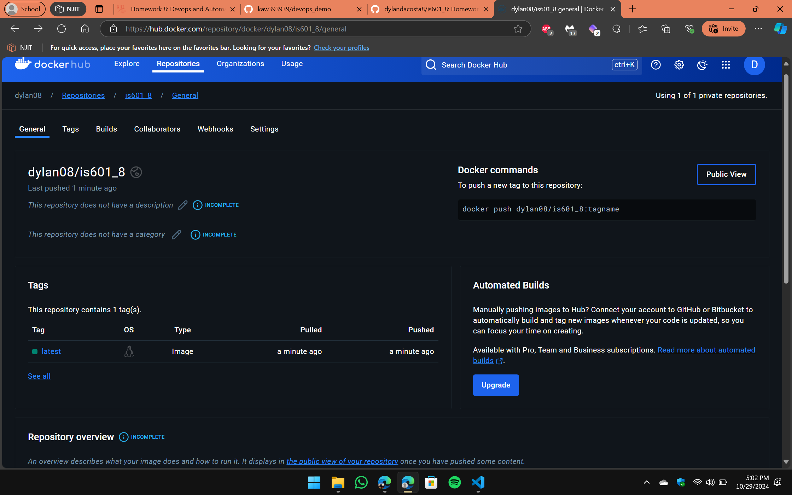
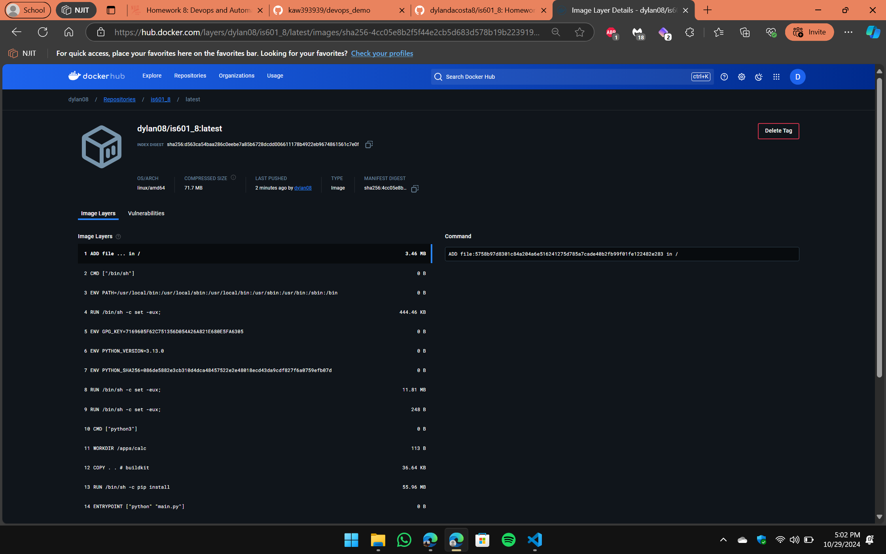

### <h1 align=center>Homework 8</h1>
---
This repository contains the dependencies and code for Homework 8 along with the Dockerfile and dotenv file to run the container

<b>On cloning the repository</b>

1. You can run the following command to run the python file directly:

```sh
pip install -r requirements.txt && python main.py
```

<div align=center>
OR
</div>

2. Run the following commands to pull the docker image from DockerHub and run it

```sh
docker image pull dylan08/is601_8:latest
```

```sh
docker run -d --name calculator --env-file .env -v /data:/apps/calc/data dylan08/is601_8:latest
```
---
### DockerHub Reposiory Link

<a href="https://hub.docker.com/r/dylan08/is601_8/tags"><b>Click Here</b></a>

---
### The Homework meets the following goals:

1. Creates a GitHub Actions CI Workflow to run tests and build and push the docker image to DockerHub

2. The image is successfully built and pushed to DockerHub using GitHub Actions Workflows as seen below:


